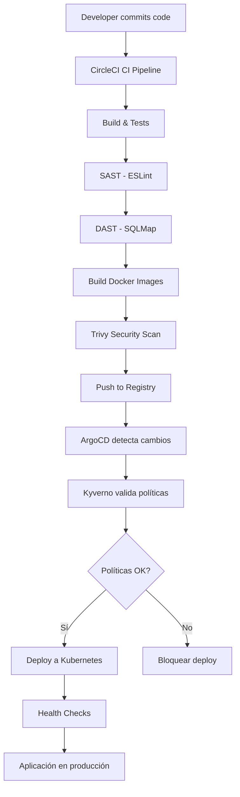

# 🚀 Implementación CI/CD con DevSecOps - Proyecto Final

## 📋 Resumen Ejecutivo

Este proyecto implementa un **flujo completo de CI/CD con prácticas DevSecOps** para la aplicación Habit Tracker, cumpliendo con los requisitos del proyecto final:

### ✅ Requisitos Implementados

1. **Pipeline CI (CircleCI)**: Build, tests, SAST, DAST y generación de artefactos
2. **Pipeline CD (ArgoCD)**: Despliegue automatizado en Kubernetes con GitOps
3. **DevSecOps**: Análisis SAST (ESLint) y DAST (SQLMap)
4. **Kubernetes**: Manifiestos completos con buenas prácticas de seguridad
5. **Validación de Políticas**: Kyverno para policy enforcement

---

## 🏗️ Arquitectura General

```
┌─────────────────────────────────────────────────────────────┐
│                     PIPELINE CI (CircleCI)                   │
│                                                              │
│  1. Build Backend + Frontend                                │
│  2. Tests Unitarios (Backend: pytest, Frontend: Jest)       │
│  3. Linting (Flake8, ESLint)                                │
│  4. SAST - ESLint Security Plugin                           │
│  5. DAST - SQLMap (Inyección SQL)                           │
│  6. Build Docker Images (Backend + Frontend)                │
│  7. Security Scan (Trivy)                                   │
│  8. Push Images to Registry                                 │
└─────────────────────────────────────────────────────────────┘
                            ↓
┌─────────────────────────────────────────────────────────────┐
│                     PIPELINE CD (ArgoCD)                     │
│                                                              │
│  1. GitOps: Monitor repositorio Git                         │
│  2. Validación de Políticas (Kyverno)                       │
│  3. Deploy a Kubernetes                                     │
│  4. Health Checks automáticos                               │
│  5. Auto-healing y auto-sync                                │
└─────────────────────────────────────────────────────────────┘
                            ↓
┌─────────────────────────────────────────────────────────────┐
│                  KUBERNETES CLUSTER                          │
│                                                              │
│  Namespace: habit-tracker                                   │
│    - Backend Deployment (2 replicas)                        │
│    - Frontend Deployment (2 replicas)                       │
│    - Services (ClusterIP + LoadBalancer)                    │
│    - Ingress Controller                                     │
│    - ConfigMaps y Secrets                                   │
└─────────────────────────────────────────────────────────────┘
```

---

## 📦 Estructura del Proyecto

```
habit-tracker/
├── .circleci/
│   └── config.yml              # Pipeline CI completo
├── argocd/
│   ├── application.yaml        # Aplicación ArgoCD
│   └── project.yaml           # Proyecto ArgoCD
├── k8s/
│   ├── namespace.yaml         # Namespace habit-tracker
│   ├── backend-configmap.yaml # Configuración backend
│   ├── backend-secret.yaml    # Secretos backend
│   ├── backend-deployment.yaml
│   ├── backend-service.yaml
│   ├── frontend-deployment.yaml
│   ├── frontend-service.yaml
│   └── ingress.yaml           # Ingress con routing
├── policies/
│   ├── require-labels.yaml          # Validación de labels
│   ├── require-security-context.yaml # Seguridad obligatoria
│   ├── require-resource-limits.yaml  # Límites de recursos
│   ├── disallow-latest-tag.yaml     # Versionado de imágenes
│   └── require-probes.yaml          # Health checks
├── Dockerfile.backend         # Imagen Docker backend
├── Dockerfile.frontend        # Imagen Docker frontend
└── CI_CD_GUIDE.md            # Este archivo
```

---

## 🔧 PARTE 1: Pipeline CI con CircleCI

### 📝 Descripción

El pipeline de **Integración Continua** automatiza:

- Build y tests
- Análisis de seguridad estático y dinámico
- Generación de artefactos Docker
- Escaneo de vulnerabilidades en imágenes

### 🚀 Configuración

#### 1. Conectar CircleCI con GitHub

```bash
# 1. Ve a https://circleci.com
# 2. Sign up con tu cuenta de GitHub
# 3. Autoriza CircleCI
# 4. Selecciona el repositorio 'habit-tracker'
# 5. Click en "Set Up Project"
```

#### 2. Estructura del Pipeline CI

**Jobs del Pipeline:**

```yaml
1. build_backend          # Build y tests Django
2. build_frontend         # Build y tests React
3. sast_eslint           # Análisis estático de seguridad
4. dast_sqlmap           # Análisis dinámico (SQL Injection)
5. build_docker_images   # Construcción de imágenes Docker
6. scan_docker_images    # Escaneo de vulnerabilidades (Trivy)
```

#### 3. Herramientas de Seguridad (DevSecOps)

##### 🔍 SAST - Static Application Security Testing

**Herramienta:** ESLint con `eslint-plugin-security`

**Qué detecta:**

- Uso de `eval()` (inyección de código)
- Expresiones regulares inseguras
- Manipulación insegura de objetos
- Uso de funciones criptográficas débiles
- Path traversal vulnerabilities

**Evidencia:**

```bash
# Ver reportes en CircleCI Artifacts:
# - sast-reports/eslint-report.json
# - sast-reports/eslint-report.html
```

##### 💉 DAST - Dynamic Application Security Testing

**Herramienta:** SQLMap

**Qué detecta:**

- Inyecciones SQL (todos los tipos)
- Vulnerabilidades en tiempo de ejecución
- Endpoints inseguros

**Targets escaneados:**

```
1. /api/vulnerable-search/?id=1    (VULNERABLE)
2. /api/vulnerable-login/?name=admin (VULNERABLE)
3. /api/habits/?id=1               (PROTEGIDO)
```

**Evidencia:**

```bash
# Ver reportes en CircleCI Artifacts:
# - dast-reports/
```

##### 🐳 Container Security Scanning

**Herramienta:** Trivy

**Qué detecta:**

- Vulnerabilidades en dependencias
- Vulnerabilidades en la imagen base
- Configuraciones inseguras

---

## 🎯 PARTE 2: Pipeline CD con ArgoCD

### 📝 Descripción

El pipeline de **Despliegue Continuo** implementa **GitOps**:

- Monitoreo automático del repositorio Git
- Sincronización automática con Kubernetes
- Auto-healing (auto-reparación)
- Validación de políticas antes del deploy

### 🚀 Configuración

#### 1. Instalar ArgoCD en Kubernetes

```bash
# Crear namespace para ArgoCD
kubectl create namespace argocd

# Instalar ArgoCD
kubectl apply -n argocd -f https://raw.githubusercontent.com/argoproj/argo-cd/stable/manifests/install.yaml

# Exponer ArgoCD UI
kubectl port-forward svc/argocd-server -n argocd 8080:443

# Obtener password inicial
kubectl -n argocd get secret argocd-initial-admin-secret -o jsonpath="{.data.password}" | base64 -d

# Login: admin / <password obtenido arriba>
```

#### 2. Aplicar configuración de ArgoCD

```bash
# Aplicar proyecto y aplicación
kubectl apply -f argocd/project.yaml
kubectl apply -f argocd/application.yaml

# Verificar que la aplicación se creó
kubectl get applications -n argocd
```

#### 3. Características del CD Pipeline

**✅ Sincronización Automática:**

- ArgoCD monitorea el branch `main` del repositorio
- Detecta cambios en `k8s/` automáticamente
- Despliega cambios sin intervención manual

**✅ Auto-Healing:**

- Si alguien modifica recursos manualmente, ArgoCD los revierte
- Garantiza que el estado del cluster = estado en Git

**✅ Prune (Limpieza):**

- Elimina recursos que ya no están en Git
- Mantiene el cluster limpio

---

## 🔒 PARTE 3: Validación de Políticas con Kyverno

### 📝 Descripción

**Kyverno** valida y aplica políticas de seguridad antes del despliegue.

### 🚀 Configuración

#### 1. Instalar Kyverno

```bash
# Agregar repositorio Helm
helm repo add kyverno https://kyverno.github.io/kyverno/
helm repo update

# Instalar Kyverno
helm install kyverno kyverno/kyverno -n kyverno --create-namespace
```

#### 2. Aplicar políticas

```bash
# Aplicar todas las políticas
kubectl apply -f policies/
```

### 📋 Políticas Implementadas

| Política                   | Descripción                 | Acción      |
| -------------------------- | --------------------------- | ----------- |
| `require-labels`           | Requiere labels: app, tier  | audit       |
| `require-security-context` | Requiere runAsNonRoot=true  | **enforce** |
| `require-resource-limits`  | Requiere CPU/Memory limits  | audit       |
| `disallow-latest-tag`      | Prohíbe tag :latest         | audit       |
| `require-probes`           | Requiere liveness/readiness | audit       |

**Nota:**

- `enforce` = **bloquea** el deploy si no cumple
- `audit` = **advierte** pero permite el deploy

---

## 🐳 PARTE 4: Despliegue en Kubernetes

### 🚀 Despliegue Manual (para pruebas)

```bash
# 1. Crear namespace
kubectl apply -f k8s/namespace.yaml

# 2. Aplicar configuración
kubectl apply -f k8s/backend-configmap.yaml
kubectl apply -f k8s/backend-secret.yaml

# 3. Desplegar aplicaciones
kubectl apply -f k8s/backend-deployment.yaml
kubectl apply -f k8s/backend-service.yaml
kubectl apply -f k8s/frontend-deployment.yaml
kubectl apply -f k8s/frontend-service.yaml

# 4. Configurar Ingress
kubectl apply -f k8s/ingress.yaml

# 5. Verificar
kubectl get all -n habit-tracker
```

### 🔍 Verificar Despliegue

```bash
# Ver pods
kubectl get pods -n habit-tracker

# Ver servicios
kubectl get svc -n habit-tracker

# Ver logs del backend
kubectl logs -f deployment/backend-deployment -n habit-tracker

# Ver logs del frontend
kubectl logs -f deployment/frontend-deployment -n habit-tracker

# Describir pod para troubleshooting
kubectl describe pod <pod-name> -n habit-tracker
```

### 🌐 Acceder a la Aplicación

```bash
# Opción 1: Port forward
kubectl port-forward svc/frontend-service -n habit-tracker 3000:80
# Acceder: http://localhost:3000

kubectl port-forward svc/backend-service -n habit-tracker 8000:8000
# Acceder: http://localhost:8000/admin

# Opción 2: NodePort (si el Service es tipo NodePort)
kubectl get svc -n habit-tracker
# Acceder: http://<NODE-IP>:<NodePort>

# Opción 3: LoadBalancer (si está en cloud)
kubectl get svc frontend-service -n habit-tracker
# Usar EXTERNAL-IP
```

---

## 🧪 PARTE 5: Pruebas y Validación

### ✅ Prueba del Pipeline CI

```bash
# 1. Hacer un cambio en el código
git add .
git commit -m "test: Trigger CI pipeline"
git push origin main

# 2. Ver ejecución en CircleCI
# https://app.circleci.com/pipelines/github/<tu-usuario>/habit-tracker

# 3. Verificar artefactos generados:
# - Coverage reports
# - SAST reports (ESLint)
# - DAST reports (SQLMap)
# - Trivy scan results
```

### ✅ Prueba del Pipeline CD

```bash
# 1. Modificar un deployment en k8s/
# Por ejemplo, cambiar replicas de 2 a 3

# 2. Commit y push
git add k8s/backend-deployment.yaml
git commit -m "feat: Scale backend to 3 replicas"
git push origin main

# 3. Ver sincronización en ArgoCD UI
# http://localhost:8080

# 4. Verificar en Kubernetes
kubectl get pods -n habit-tracker
# Deberías ver 3 replicas del backend
```

### ✅ Prueba de Políticas

```bash
# Intentar desplegar un pod sin securityContext
cat <<EOF | kubectl apply -f -
apiVersion: apps/v1
kind: Deployment
metadata:
  name: test-deployment
  namespace: habit-tracker
spec:
  replicas: 1
  selector:
    matchLabels:
      app: test
  template:
    metadata:
      labels:
        app: test
    spec:
      containers:
      - name: test
        image: nginx:latest
EOF

# Kyverno debería BLOQUEAR este deployment por:
# - No tener securityContext
# - Usar tag :latest

# Ver políticas violadas
kubectl get policyreport -n habit-tracker
```

---

## 📊 PARTE 6: Evidencias para la Tarea

### 🎯 Evidencia 1: Pipeline CI Ejecutándose

**Captura de pantalla de:**

1. CircleCI dashboard mostrando todos los jobs
2. Job SAST completado con reportes
3. Job DAST con resultados de SQLMap
4. Trivy scan mostrando vulnerabilidades

**Ubicación de reportes:**

- CircleCI → Artifacts → sast-reports/
- CircleCI → Artifacts → dast-reports/
- CircleCI → Artifacts → trivy-reports/

### 🎯 Evidencia 2: Pipeline CD con ArgoCD

**Captura de pantalla de:**

1. ArgoCD UI mostrando la aplicación "habit-tracker"
2. Estado "Synced" y "Healthy"
3. Topology view mostrando todos los recursos
4. Logs de sincronización

**Comandos para evidencia:**

```bash
kubectl get applications -n argocd -o yaml > evidencia-argocd-app.yaml
kubectl get all -n habit-tracker > evidencia-k8s-resources.txt
```

### 🎯 Evidencia 3: Políticas Aplicadas

**Captura de pantalla de:**

1. Todas las políticas instaladas
2. Policy reports
3. Intento de deploy violando políticas (bloqueado)

**Comandos para evidencia:**

```bash
kubectl get clusterpolicies > evidencia-policies.txt
kubectl get policyreport -A > evidencia-policy-reports.txt
```

### 🎯 Evidencia 4: Aplicación Desplegada

**Captura de pantalla de:**

1. Pods corriendo en Kubernetes
2. Servicios expuestos
3. Aplicación funcionando en el navegador
4. Health checks pasando

**Comandos para evidencia:**

```bash
kubectl get pods -n habit-tracker -o wide > evidencia-pods.txt
kubectl get svc -n habit-tracker > evidencia-services.txt
kubectl describe deployment backend-deployment -n habit-tracker > evidencia-backend-deployment.txt
```

---

## 🔄 Flujo Completo (De principio a fin)



---

## 📚 Recursos y Documentación

### CircleCI

- [Documentación Oficial](https://circleci.com/docs/)
- [Config Reference](https://circleci.com/docs/configuration-reference/)

### ArgoCD

- [Documentación Oficial](https://argo-cd.readthedocs.io/)
- [Getting Started](https://argo-cd.readthedocs.io/en/stable/getting_started/)

### Kyverno

- [Documentación Oficial](https://kyverno.io/docs/)
- [Policy Library](https://kyverno.io/policies/)

### Kubernetes

- [Documentación Oficial](https://kubernetes.io/docs/)
- [Best Practices](https://kubernetes.io/docs/concepts/configuration/overview/)

---

## 🆘 Troubleshooting

### Pipeline CI falla

```bash
# Ver logs en CircleCI
# Jobs → Click en el job fallido → Ver output

# Re-ejecutar pipeline
# CircleCI UI → Rerun Workflow
```

### ArgoCD no sincroniza

```bash
# Forzar sincronización manual
kubectl patch application habit-tracker -n argocd -p '{"operation": {"sync": {}}}' --type merge

# Ver logs de ArgoCD
kubectl logs -f deployment/argocd-application-controller -n argocd
```

### Pods no inician

```bash
# Ver por qué falla
kubectl describe pod <pod-name> -n habit-tracker

# Ver logs del pod
kubectl logs <pod-name> -n habit-tracker

# Ver eventos
kubectl get events -n habit-tracker --sort-by='.lastTimestamp'
```

### Políticas bloquean deploy

```bash
# Ver qué política está fallando
kubectl get policyreport -n habit-tracker -o yaml

# Ajustar el manifest para cumplir la política
# O cambiar la política de "enforce" a "audit"
```

---

## ✅ Checklist de Entrega

- [ ] Pipeline CI configurado en CircleCI
- [ ] Pipeline CD configurado con ArgoCD
- [ ] Herramienta SAST (ESLint) funcionando
- [ ] Herramienta DAST (SQLMap) funcionando
- [ ] Imágenes Docker creadas
- [ ] Manifiestos Kubernetes completos
- [ ] Políticas Kyverno aplicadas
- [ ] Aplicación desplegada en K8s
- [ ] Evidencias capturadas (screenshots + archivos)
- [ ] Documentación completa

---

## 👤 Autor

**Juan Álvarez**  
Proyecto Final - Ingeniería de Software  
Fecha: Enero 2026

---

## 📄 Licencia

Este proyecto es para fines educativos.
